# AutoWechat_LMStudio
使用LMStudio和Python实现微信自动AI回复
# 微信智能自动回复机器人

## 目录

- [项目简介](#项目简介)
- [功能特点](#功能特点)
- [LM Studio和模型安装](#LM-Studio和模型安装)
- [Python准备](#Python准备)
- [函数说明](#函数说明)
- [使用方法](#使用方法)
## 项目简介
本项目是一个基于微信的智能自动回复机器人，结合了微信消息监听和流式对话 API 的功能。当用户在微信群或私聊中发送包含 `@乌龟向上爬` 的消息时，机器人会自动调用对话 API 生成回复，并将回复内容发送回微信。

## 功能特点
1. **微信消息监听**：实时监听微信消息，支持群聊和私聊。
2. **触发回复**：仅当消息中包含 `@乌龟向上爬` 时触发回复。
3. **流式对话 API**：调用流式对话 API 生成回复，支持实时流式输出。
4. **过滤无效内容**：自动过滤 `<think>` 标签和空行，确保回复内容简洁。
5. **排除自己消息**：自动排除自己发送的消息，避免重复触发。

---

## LM Studio和模型安装
### 1. 官网下载：[LM Studio](https://lmstudio.ai/) 
没什么弯弯绕绕，直接下载对应平台，然后安装即可。安装好后在设置中可以找到语言，设置为中文。

### 2. 下载模型
1. 大多数教程都是去[Hugging Face](https://huggingface.co/)下载，但是要魔法
2. 没有魔法的话，可以去镜像网站：[hf-mirror](https://hf-mirror.com/)
3. 但是直接去找模型对于新手不仅眼花，而且容易白下载不合适的模型，建议在lmstudio里面下，最简单也最直观：
- 点击左侧的放大镜切页，打开下载界面，在上面搜索deepseek或者其他感兴趣的，然后找到右边的详情：（有可能会存在搜索失败的情况，可以试多几次，应该不用魔法）
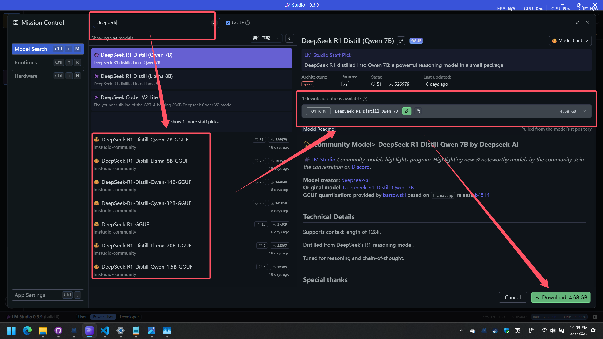
- 在详情界面点击图中的绿色小标代表说可以完美运行30t/s以上吧，小窗口可能需要调整下参数，红色的就几乎完全不能跑了，可以看情况选择（可参考本人硬件推理速度对比在下面，一般来说1.5B的参数量在没有集显的CPU上也能很流畅）
  <div>
    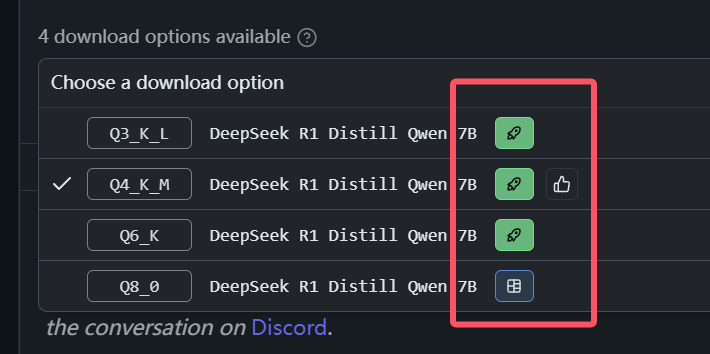
    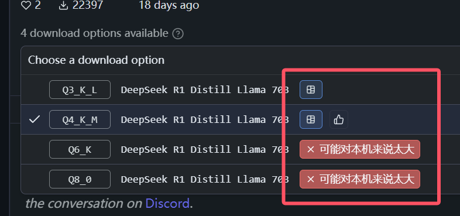
  </div>
- 最后点击下载即可。

## 性能对比表(除了1.5B是Q8，其他都是Q4)
### 参考硬件：
#### ROG笔记本
- **CPU**:  AMD Ryzen 9 7945HX
- **内存**: 64G 
- **显卡**: 4080 12GB 
#### MacBook Air
- **CPU**:  M2
- **内存**: 16G 
---

| 模型    | rog性能 | Labtop |mac性能|Macbook|
|-------------|----------------------|------|------|------|
| 1.5B        | 87 t/s   | 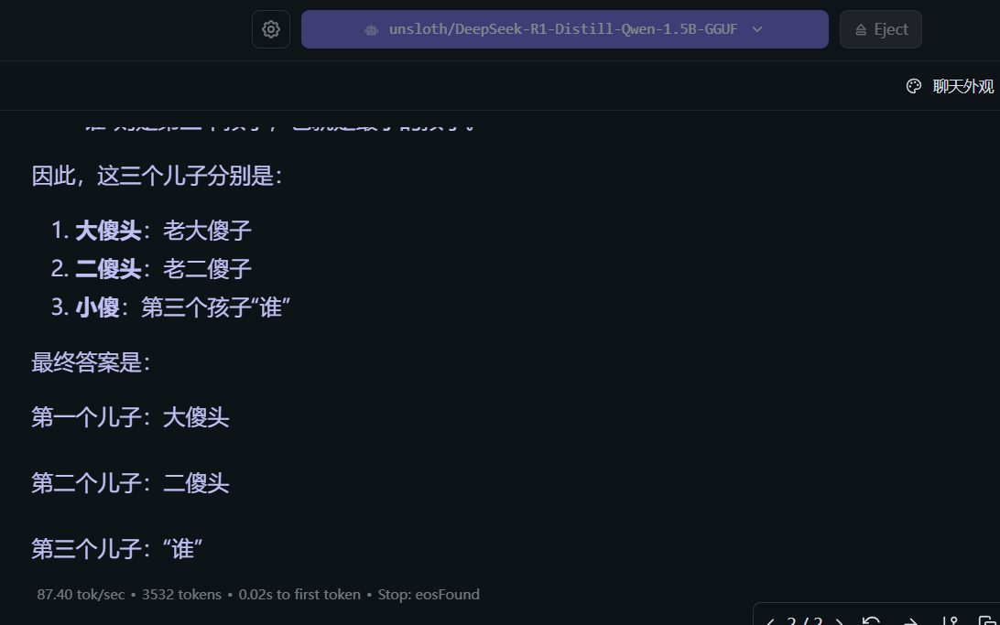 | 18.27 t/s |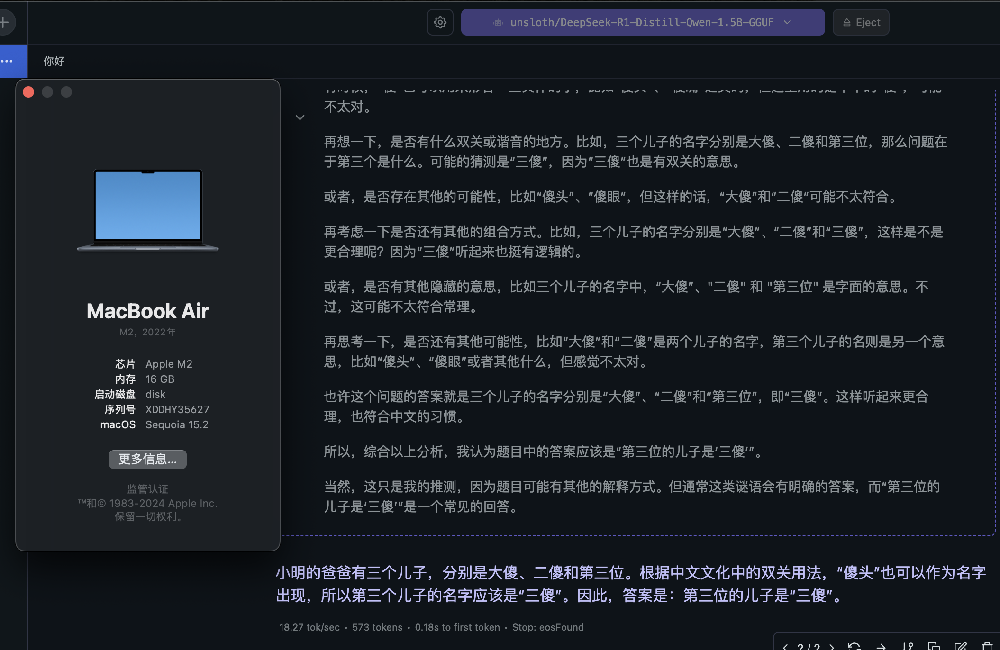 |
| 8B          | 55 t/s   | 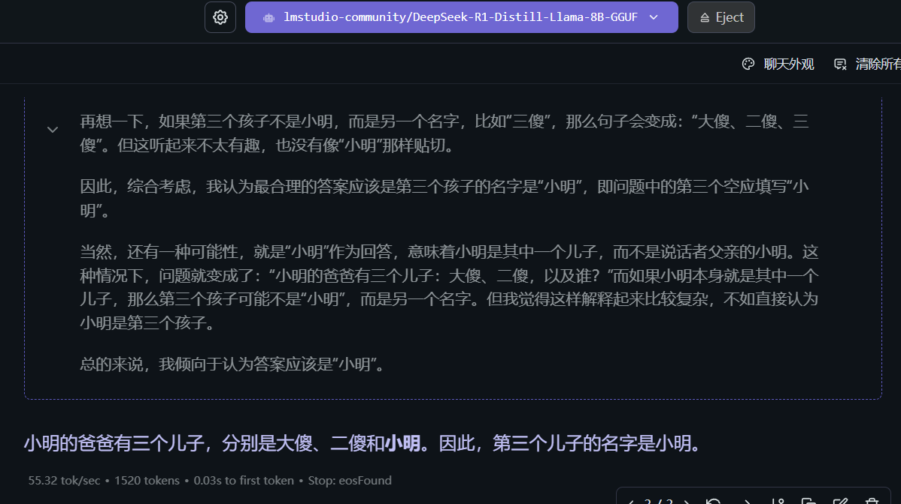     | 5.0 t/s    | 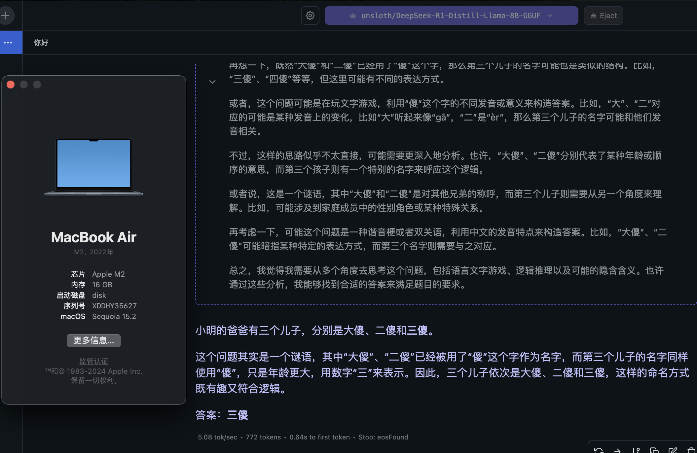   |
| 14B         | 31 t/s   | 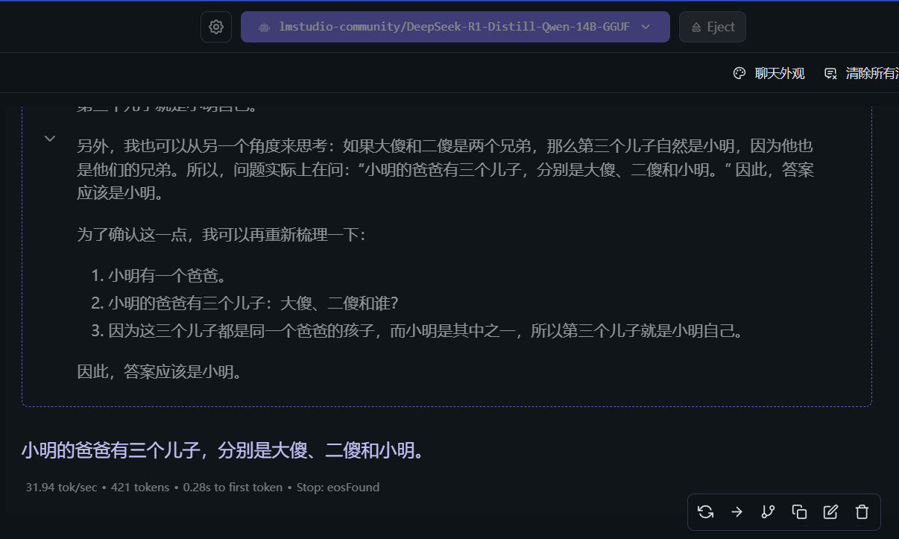   |           |   |
| 32B         | 3.6 t/s  | 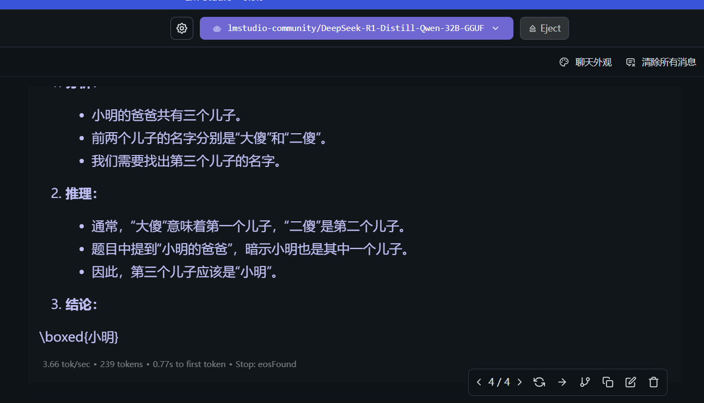   |           |   |
| 70B         | 0.07 t/s | 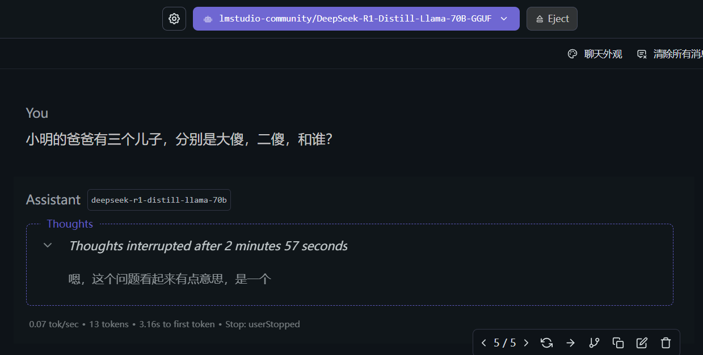   |           |   |
---


### 3. 尝试对话和参数调优
如果只是想直接使用模型，左边栏第一个切页，顶部栏选择已经下载好的模型等待加载完毕就行了。如果还想进行微信自动回复，也可以先在这里尝试调整出最适合自自己设备的参数，可以参考B站有个大佬对参数进行了详细说明：[DeepSeek R1 推理模型 性能调优](https://www.bilibili.com/video/BV1qoFGepEhL/?spm_id_from=333.1391.0.0&vd_source=0deefafa7585b7d517a1cf319da418b0)
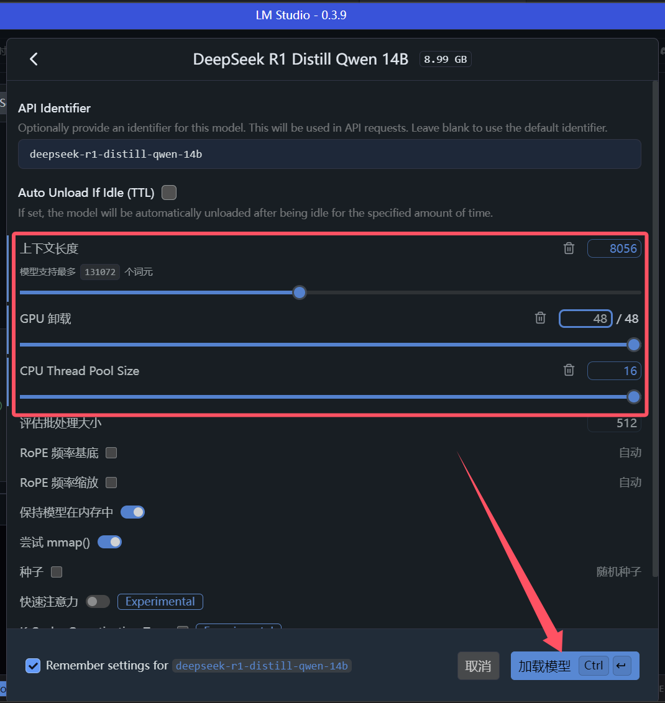

### 4. 后台运行和关键参数获取
- 切换到左侧栏第二个切页，开发者切页，并且和上一步一样，选择模型，点击加载
  <div>
    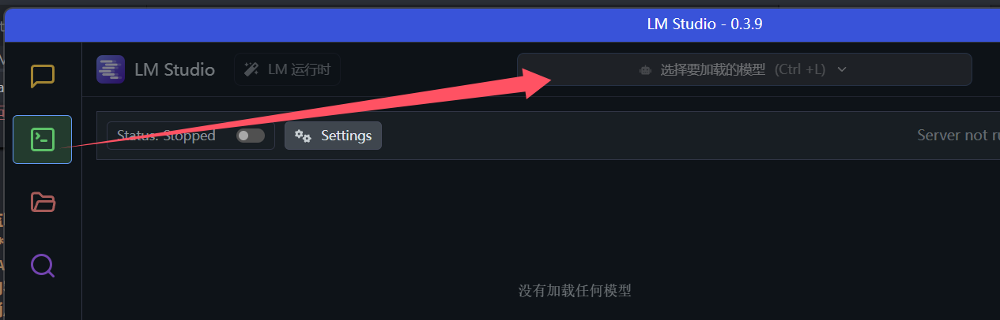
    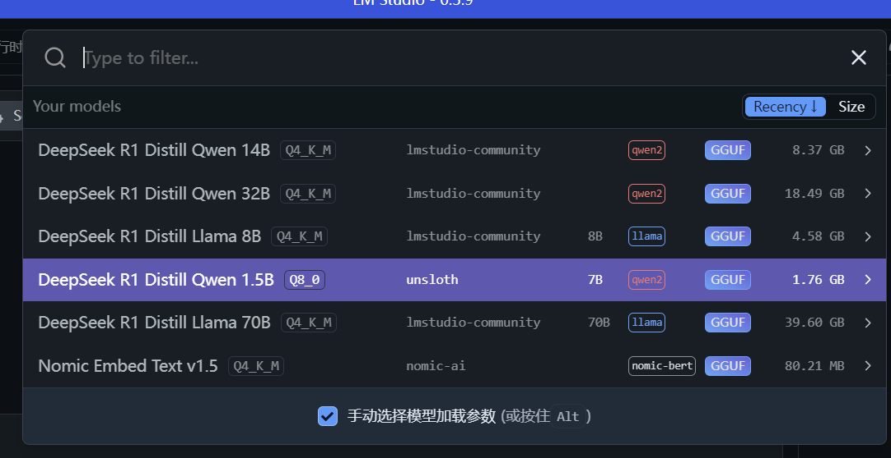
  </div>
---
- 模型显示绿色的Ready后，把Status开关打开，这时候能看到右边有个localhost地址和端口，本地玩的话不用管。
- 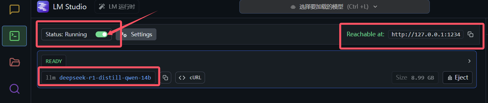
- PS：如果有兴趣，可以在右上角点开这个文档，我也是从这里拿到post请求的head和body格式的。
- 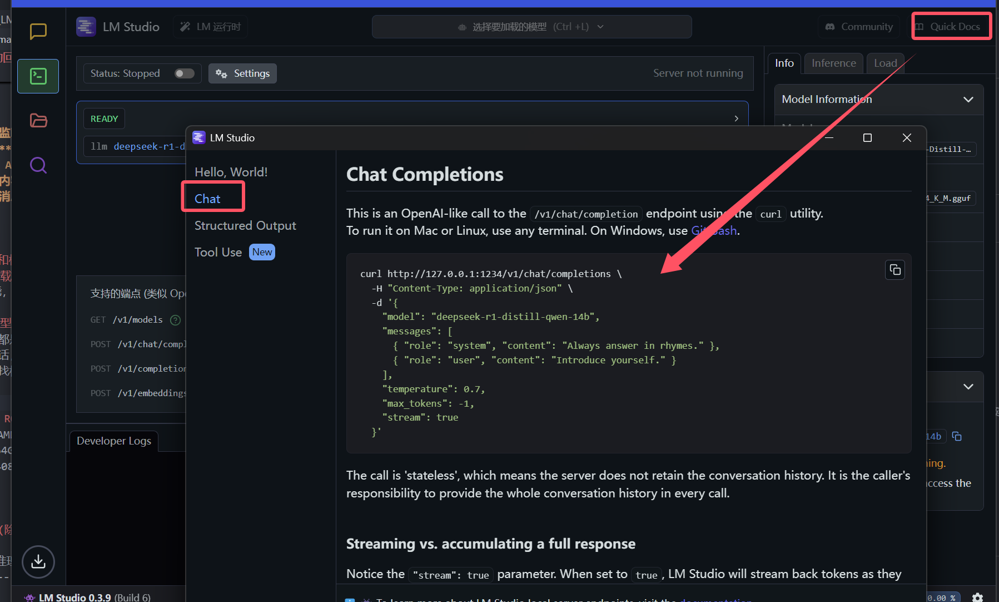
## Python准备

### 1. Python 安装
确保已安装 Python 3.11 或更高版本。可以从 [Python 官网](https://www.python.org/downloads/) 下载并安装。

### 2. 安装依赖库
这里只用到一个wxauto库，运行以下命令安装项目所需的 Python 库：
```bash
pip install wxauto requests
```

#### 依赖库说明：
- **`wxauto`**：用于监听和操作微信客户端。
- **`requests`**：用于发送 HTTP 请求，调用对话 API。
- **`json`**：用于解析 API 返回的 JSON 数据。
- **`re`**：用于正则表达式处理，过滤无效内容。

---

## 函数说明

### 1. `remove_think_tags(text)`
- **功能**：去掉 `<think>` 到 `</think>` 之间的内容。
- **参数**：
  - `text`：需要处理的字符串。
- **返回值**：去掉 `<think>` 标签后的字符串。

### 2. `remove_empty_lines(text)`
- **功能**：去掉字符串中的空行。
- **参数**：
  - `text`：需要处理的字符串。
- **返回值**：去掉空行后的字符串。

### 3. `get_api_reply(user_input)`
- **功能**：调用对话 API 获取回复。
- **参数**：
  - `user_input`：用户输入的内容。
- **返回值**：API 返回的回复内容。

### 4. `auto_reply()`
- **功能**：微信自动回复主逻辑。
  - 监听微信消息。
  - 过滤自己发送的消息。
  - 当消息包含 `@你的微信昵称` 时，调用 `get_api_reply` 生成回复并发送。

---

## 使用方法

### 1. 配置 API 地址（本地的话默认localhost和1234端口即可，或者自己设置）
修改代码中的 `url` 变量，将其设置为你的对话 API 地址：
```python
url = "http://127.0.0.1:1234/v1/chat/completions"
```

### 2. 运行程序
在终端中运行以下命令启动程序：
```bash
python wechat_bot.py
自动回复机器人正在运行...
可选择的模型:
1. deepseek-r1-distill-qwen-1.5b
2. nomic-ai/nomic-embed-text-v1.5-GGUF
3. text-embedding-nomic-embed-text-v1.5
请输入选择的模型编号:
```
- 运行后会列出可选模型，输入你想运行的模型后回车开始运行
### 3. 使用说明（已更新无过滤版本）
1. 确保微信客户端已登录，并且 `wxauto` 能够正确连接到微信，并且微信自动被调出到前台。
2. 在微信群或私聊中发送包含 `@你的微信昵称` 的消息，例如：
   ```
   @你的微信昵称 你好
   ```
3. 机器人会自动回复：
   ```
   你好，我是你的AI助手，有什么可以帮您的吗？
   ```

---

## 示例1（有过滤）

### 1. 用户输入
```
用户A：@你的微信昵称 你好
```

### 2. 机器人回复
```
你的微信昵称：你好！很高兴见到你，有什么我可以帮忙的吗？。@用户A
```

## 示例2（无过滤）

### 1. 用户输入
```
用户A：你好
```

### 2. 机器人回复
```
你的微信昵称：你好！很高兴见到你，有什么我可以帮忙的吗？。
```